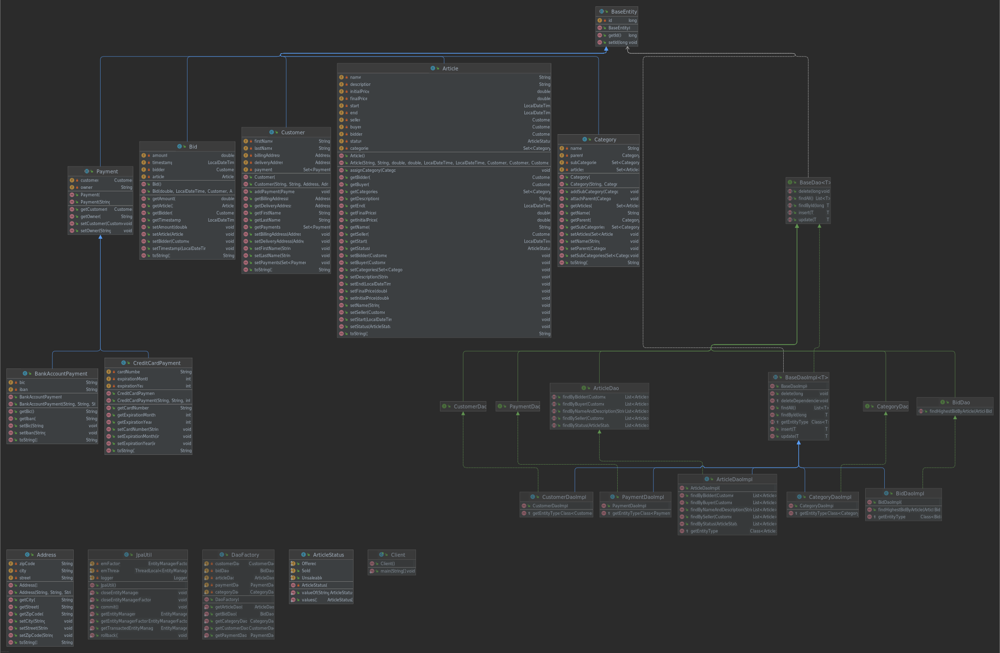
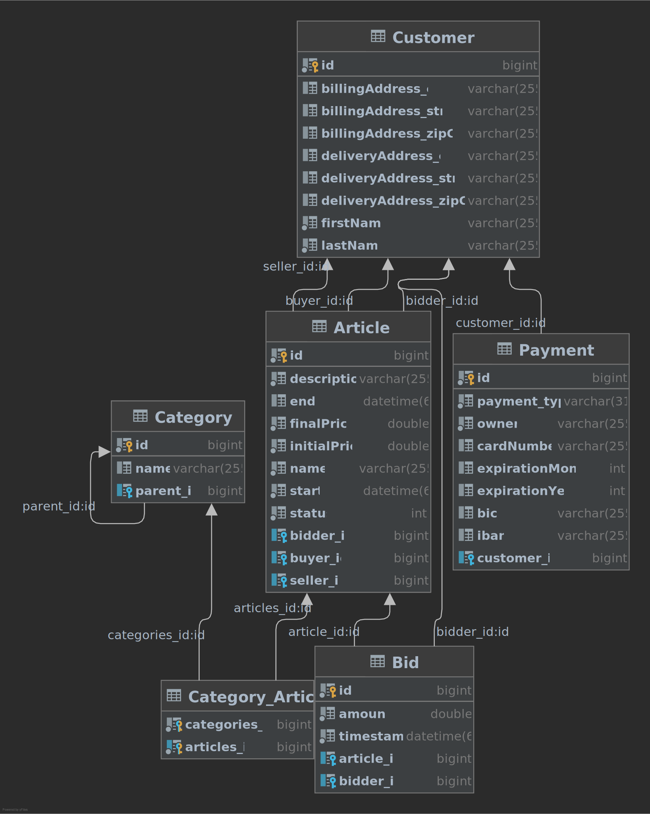

# FH Bay

Database layer for an ebay clone with my sql and docker.
For unit tests a h2 in memory db is used.

Steps for starting the application
 
- Run `docker compose up`
- Start client with `mvn exec:java -pl fh-bay.dal`

Steps for running unit tests

- Run `mvn test`

## Class diagram

## ER-Diagram

